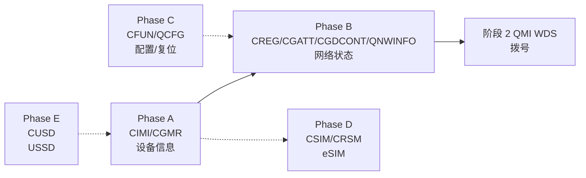

# AT 命令对齐路线图

> 基于 `docs/10-at-commands-alignment.md` + SG/VH 源码核实,
> 只补 **sms_gateway 或 vohive 源码里实际发过**的命令(共 11 条)。
> 两边都没覆盖的命令(CEREG/CGREG/CGEREP/QGDCNT/CEER/QINISTAT 等)不补。
> 创建于 2026-07-12。

---

## 一、筛选依据

对 SG 源码(`source/sms_gateway/agent/internal/modem/*.go`)和 VH 源码
(`source/vohive-collection/vohive/internal/modem/*.go`)做了 `grep` 全量提取,
逐条核对每条 🔲 命令"上游有没有发过"。

**结果:11 条需要补(全是 VH 独有,SG 一条都没多覆盖)。**

| 命令 | SG 源码 | VH 源码 | VH 用法(证据) |
|---|---|---|---|
| `AT+CIMI` | ❌ | ✅ | `manager.go` 发 `AT+CIMI` 取 IMSI |
| `AT+CGMR` | ❌ | ✅ | `manager.go` 发 `AT+CGMR` 取软件版本 |
| `AT+CFUN` | ❌ | ✅ | `AT+CFUN=1,1` 复位(`at_backend` 拼 `CFUN=%d`) |
| `AT+CGATT` | ❌ | ✅ | `AT+CGATT=0` / `AT+CGATT=1` 附着/分离 |
| `AT+CGDCONT` | ❌ | ✅ | 定义 PDP context(拨号路径) |
| `AT+CREG` | ❌ | ✅ | `AT+CREG?` CS 注册状态 |
| `AT+QNWINFO` | ❌ | ✅ | 网络 Act/运营商/频段/信道 |
| `AT+QCFG` | ❌ | ✅ | USBNET/USBCFG 等扩展配置 |
| `AT+CSIM` | ❌ | ✅ | APDU 透传(SIM/eSIM 访问) |
| `AT+CRSM` | ❌ | ✅ | 受限 SIM 访问(READ/UPDATE BINARY) |
| `AT+CUSD` | ❌ | ✅ | USSD(查话费/余额) |

> **不补的**:AT+CEREG/CGREG/CGEREP(CGATT VH 有但 CEREG/CGREG 没有)、
> AT+CSMS/CMGW/CMSS/CMMS(两边都没有)、AT+CEER/CPAS/QINISTAT/QPINC(两边都没有)、
> V.25ter 基础(AT&F/Z/Q/V/S3-5,两边都没有)、QoS 系列(CGQREQ 等,两边都没有)。

---

## 二、分阶段计划

### 文件归属

| 新文件 | 内容 | 命令 |
|---|---|---|
| `sms.go`(扩展) | 设备信息 | CIMI, CGMR |
| `network.go`(新) | 网络/注册/PDP | CREG, CGATT, CGDCONT, QNWINFO |
| `config.go`(新) | 配置/复位 | CFUN, QCFG |
| `sim.go`(新) | APDU 透传 | CSIM, CRSM |
| `ussd.go`(新,可选) | USSD | CUSD |

> 也可全部放 `sms.go`——现有模式里设备查询(ICCID/IMEI/Carrier)已在 sms.go。
> 拨号相关(CREG/CGATT/CGDCONT)单独建 `network.go` 更清晰。

### 实现模式(统一)

```go
func (m *Modem) XXX(ctx context.Context) (T, error) {
    lines, err := m.SendAndWait(ctx, "AT+XXX", timeout)
    // parse → return
}
```
+ 离线测试 `feedAfterDelay` + 硬件验证。

---

### Phase A — 设备信息补全(2 条,低风险,立即)

#### A1. `AT+CIMI` → `IMSI(ctx)`

- **手册**:EC25 §5.1,TS 27.007
- **语法**:`AT+CIMI`
- **响应**:直接输出 IMSI 数字串(无 `+CIMI:` 前缀)+ OK
- **VH 证据**:`manager.go` 发 `AT+CIMI`

```go
// sms.go
func (m *Modem) IMSI(ctx context.Context) (string, error) {
    lines, err := m.SendAndWait(ctx, "AT+CIMI", 3*time.Second)
    if err != nil { return "", err }
    for _, l := range lines {
        if s := strings.TrimSpace(l); isDigits(s) && len(s) >= 14 { return s, nil }
    }
    return "", errors.New("CIMI: no IMSI in response")
}
```

- **测试**:离线 `feedAfterDelay(port, "460011234567890\r\nOK\r\n")`
- **硬件**:扩展 `TestHardwareDeviceInfo`

#### A2. `AT+CGMR` → `SoftwareVersion(ctx)`

- **手册**:EC25 §2.7,TS 27.007
- **语法**:`AT+CGMR`
- **响应**:直接输出版本字符串 + OK
- **VH 证据**:`manager.go` 发 `AT+CGMR`

```go
// sms.go
func (m *Modem) SoftwareVersion(ctx context.Context) (string, error) {
    lines, err := m.SendAndWait(ctx, "AT+CGMR", 3*time.Second)
    if err != nil { return "", err }
    if len(lines) > 0 { return strings.TrimSpace(lines[0]), nil }
    return "", errors.New("CGMR: empty response")
}
```

---

### Phase B — 网络注册/拨号状态(4 条)

> 新建 `network.go`。主走 QMI WDS,这些 AT 是状态可见性 + 排查备用。

#### B1. `AT+CREG` → `CSRegistration(ctx)`

- **手册**:EC25 §6.2,TS 27.007
- **语法**:`AT+CREG?`
- **响应**:`+CREG: <n>,<stat>[,<lac>,<ci>]`,stat: 1=home,5=roaming,0=not registered
- **VH 证据**:`manager.go` 发 `AT+CREG`

```go
// network.go
type RegInfo struct {
    Registered bool
    Roaming    bool
    Stat       int
    LAC        string
    CellID     string
}

func (m *Modem) CSRegistration(ctx context.Context) (RegInfo, error) {
    lines, err := m.SendAndWait(ctx, "AT+CREG?", 3*time.Second)
    // parse +CREG: <n>,<stat>[,<lac>,<ci>]
}
```

#### B2. `AT+CGATT` → `PSAttached(ctx)` / `SetPSAttach(ctx, state)`

- **手册**:EC25 §10.1,TS 27.007
- **语法**:`AT+CGATT?` / `AT+CGATT=<state>`
- **响应**:`+CGATT: <state>`(0/1)
- **VH 证据**:`AT+CGATT=0` / `AT+CGATT=1`

```go
func (m *Modem) PSAttached(ctx context.Context) (bool, error) {
    lines, err := m.SendAndWait(ctx, "AT+CGATT?", 3*time.Second)
    // parse +CGATT: 0/1
}
func (m *Modem) SetPSAttach(ctx context.Context, attached bool) error {
    v := 0; if attached { v = 1 }
    _, err := m.SendAndWait(ctx, fmt.Sprintf("AT+CGATT=%d", v), 10*time.Second)
    return err
}
```

#### B3. `AT+CGDCONT` → `DefinePDP` / `ListPDPs`

- **手册**:EC25 §10.2,TS 27.007
- **语法**:`AT+CGDCONT=<cid>,<type>,<APN>` / `AT+CGDCONT?`
- **响应**:`+CGDCONT: <cid>,<type>,<apn>,<addr>,...`
- **VH 证据**:`manager.go` 定义 PDP context

```go
type PDPContext struct {
    CID  int
    Type string // "IP"/"IPV6"/"IPV4V6"
    APN  string
    Addr string // 分配的 IP
}

func (m *Modem) DefinePDP(ctx context.Context, cid int, pdpType, apn string) error {
    _, err := m.SendAndWait(ctx,
        fmt.Sprintf(`AT+CGDCONT=%d,"%s","%s"`, cid, pdpType, apn), 5*time.Second)
    return err
}
func (m *Modem) ListPDPs(ctx context.Context) ([]PDPContext, error) {
    lines, err := m.SendAndWait(ctx, "AT+CGDCONT?", 5*time.Second)
    // parse +CGDCONT lines
}
```

#### B4. `AT+QNWINFO` → `NetworkInfo(ctx)`

- **手册**:EC25 §6.9,Quectel 私有
- **语法**:`AT+QNWINFO`
- **响应**:`+QNWINFO: "<act>","<operator>",<band>,<channel>`
- **VH 证据**:`manager.go` 发 `AT+QNWINFO`

```go
type NetworkInfo struct {
    Act       string // "LTE"/"WCDMA"/...
    Operator  string
    Band      int
    Channel   int
}

func (m *Modem) NetworkInfo(ctx context.Context) (NetworkInfo, error) {
    lines, err := m.SendAndWait(ctx, "AT+QNWINFO", 3*time.Second)
    // parse +QNWINFO: "LTE","46000",3,1234
}
```

---

### Phase C — 配置/复位(2 条)

#### C1. `AT+CFUN` → `SetFunctionLevel(ctx, fun)`

- **手册**:EC25 §2.22,TS 27.007
- **语法**:`AT+CFUN=<fun>[,<rst>]`
- **参数**:1=全功能,4=飞行模式(RF off),1,1=复位重启,0=最小功能
- **VH 证据**:`AT+CFUN=1,1` 复位(`at_backend` 拼 `CFUN=%d`)

```go
// config.go
func (m *Modem) SetFunctionLevel(ctx context.Context, fun int, reset bool) error {
    if reset {
        _, err := m.SendAndWait(ctx, fmt.Sprintf("AT+CFUN=%d,1", fun), 15*time.Second)
        return err
    }
    _, err := m.SendAndWait(ctx, fmt.Sprintf("AT+CFUN=%d", fun), 5*time.Second)
    return err
}
```

#### C2. `AT+QCFG` → `SetQCFG(ctx, type, value)`

- **手册**:EC25 §4.3,Quectel 私有
- **语法**:`AT+QCFG="<type>"[,<value>...]`
- **VH 证据**:`manager.go` 用 QCFG 配 USBNET/USBCFG

```go
func (m *Modem) SetQCFG(ctx context.Context, cfgType string, args ...string) error {
    parts := []string{fmt.Sprintf(`"%s"`, cfgType)}
    parts = append(parts, args...)
    _, err := m.SendAndWait(ctx, "AT+QCFG="+strings.Join(parts, ","), 5*time.Second)
    return err
}
```

---

### Phase D — SIM/eSIM APDU 透传(2 条)

> 新建 `sim.go`。为 eSIM profile 管理打基础,可复用 `uicc-go`。

#### D1. `AT+CSIM` → `CSIM(ctx, apdu)`

- **手册**:EC25 §5.5,TS 27.007
- **语法**:`AT+CSIM=<length>,<command>`
- **响应**:`+CSIM: <length>,<response>`
- **VH 证据**:`manager.go` 发 `AT+CSIM`(SIM APDU 透传)

```go
// sim.go
func (m *Modem) CSIM(ctx context.Context, apdu []byte) ([]byte, error) {
    hexCmd := hex.EncodeToString(apdu)
    cmd := fmt.Sprintf("AT+CSIM=%d,\"%s\"", len(hexCmd), hexCmd)
    lines, err := m.SendAndWait(ctx, cmd, 5*time.Second)
    // parse +CSIM: <len>,"<hex response>"
}
```

#### D2. `AT+CRSM` → `ReadSIMFile` / `WriteSIMFile`

- **手册**:EC25 §5.6,TS 27.007
- **语法**:`AT+CRSM=<cmd>[,<fileid>,<p1>,<p2>,<p3>[,<data>]]`
- **响应**:`+CRSM: <sw1>,<sw2>[,<response>]`
- **VH 证据**:`manager.go` 发 `AT+CRSM`

```go
func (m *Modem) ReadSIMFile(ctx context.Context, fileID int, p1, p2, p3 int) ([]byte, error) {
    cmd := fmt.Sprintf("AT+CRSM=176,%d,%d,%d,%d", fileID, p1, p2, p3) // 176=READ BINARY
    lines, err := m.SendAndWait(ctx, cmd, 5*time.Second)
    // parse +CRSM: <sw1>,<sw2>,<hex response>
}
```

---

### Phase E — USSD(1 条)

#### E1. `AT+CUSD` → `SendUSSD(ctx, code)`

- **手册**:EC25 §11(补充业务),TS 27.007
- **语法**:`AT+CUSD=1,"<code>",15`
- **响应 URC**:`+CUSD: <m>,<str>,<dcs>`
- **VH 证据**:`manager.go` 发 `AT+CUSD` + 处理 `+CUSD:` URC

```go
// usd.go 或 sms.go
func (m *Modem) SendUSSD(ctx context.Context, code string) error {
    _, err := m.SendAndWait(ctx,
        fmt.Sprintf(`AT+CUSD=1,"%s",15`, code), 5*time.Second)
    return err
}
// +CUSD: URC 通过现有 OnURC dispatch 给调用方 parse
```

---

## 三、阶段依赖



- **Phase A 立即可做**(无依赖,低风险)
- **Phase B 依赖 Phase A**(都需 Initialize 先跑通)
- **Phase C/D/E 独立**,可并行/按需

---

## 四、验收标准

| 层 | 要求 |
|---|---|
| **离线测试** | 每个新方法一个 `feedAfterDelay` + ScriptPort mock 测试,解析正确 |
| **硬件验证** | Phase A/B 核心命令在真实 EC25 上跑通,返回值合理 |
| **docs/10 更新** | 每补一条,docs/10 §三 状态从 🔲 改 ✅ |

---

## 五、工作量估算

| Phase | 命令数 | 新代码(含测试) | 新文件 |
|---|---|---|---|
| A 设备信息 | 2 | ~40 行 | sms.go 扩展 |
| B 网络状态 | 4 | ~120 行 | network.go(新) |
| C 配置/复位 | 2 | ~30 行 | config.go(新) |
| D SIM/eSIM | 2 | ~50 行 | sim.go(新) |
| E USSD | 1 | ~15 行 | sms.go 或 ussd.go |
| **合计** | **11** | **~255 行** | **3 个新文件** |

---

## 六、不补的命令(两边都没有)

> 以下命令 SG 和 VH 源码均未发过,暂不实现。需要时直接 `m.SendAndWait` 手发。

| 分类 | 命令 | 原因 |
|---|---|---|
| V.25ter 基础 | AT&F/&V/&W/Z/Q/V/S3-5/GMI/GMM/GMR | 排障手发 |
| SMS 进阶 | CSMS/CMGW/CMSS/CMMS/CNMA/CSDH/CSMP | PDU 模式非必需 |
| 网络注册(EPS) | CEREG/CGREG/CGEREP | 两边都没(VH 只查 CREG);阶段 2 QMI 路径 |
| QoS | CGQREQ/CGQMIN/CGEQREQ/CGEQMIN | 用默认 |
| 排障/状态 | CEER/CPAS/QINISTAT/QPINC | 手发 |
| 数据 | CGDATA/CGPADDR/QGDCNT/QAUGDCNT/CGSMS | 阶段 3 按需 |
| 硬件 | QPOWD/CCLK/CBC/QSCLK | 手发 |
| 其他 | QURCCFG/QINDCFG/QSPN/QLTS/CTZU/CTZR | 手发 |

---

## 七、相关文档

- `docs/10-at-commands-alignment.md` — 对齐状态(逐命令 + 上游溯源 + 大类评分)
- `docs/08-ec25-at-commands-index.md` — EC25 手册索引(命令语法主参考)
- `docs/05-sms-gateway-modem-analysis.md` — SG 源码剖析
- `docs/06-vohive-modem-analysis.md` — VH 源码剖析
