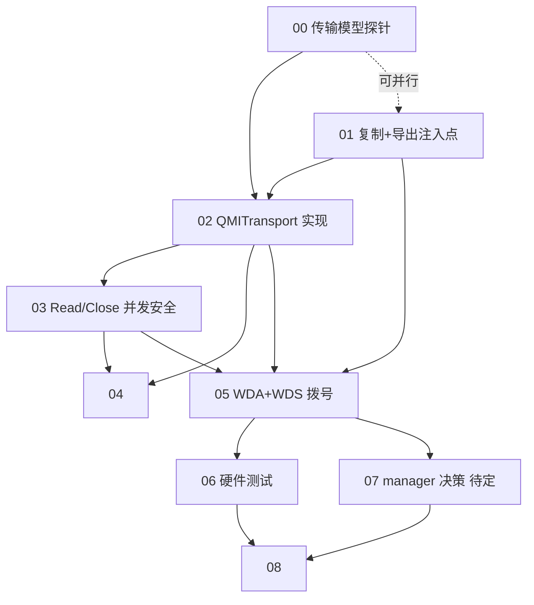

# 阶段 2 实施计划:QMI 通道 + 拨号(总览)

> 基于 `docs/01` §六阶段 2 路线图。阶段 1(AT+短信)已完成。
> 创建于 2026-07-12。经 quectel-qmi-go 源码 + issue/001 + references 二次调研修订。
>
> 目标:USB 直连 MI_04,用 quectel-qmi-go 的 WDS 拨号,拿到运营商 IP。阶段 3 把 IP 注入 TUN。

本计划已拆分为 9 个独立子计划(`plans/stage2/00-08`),逐步完成。

---

## 子计划索引

| # | 子计划 | 依赖 | 状态 | 文件 |
|---|---|---|---|---|
| 00 | Phase 0 传输模型探针 | Zadig WinUSB | ✅ 完成:**模型 B(EP0 控制封装)+ DTR** | `00-phase0-transport-probe.md` |
| 01 | 复制 quectel-qmi-go + 导出注入点 | 无(可与 00 并行) | ✅ 完成:`NewClientFromTransport` + `Transport` 导出 | `01-copy-and-export-injection.md` |
| 02 | QMITransport 实现(按 Phase 0) | 00(模型 B + DTR)+ 01(接口) | ✅ 完成:模型 B EP0 封装 + DTR + interrupt goroutine + ioMu | `02-qmitransport-impl.md` |
| 03 | Read/Close 并发安全(issue/001) | 02 | ✅ 完成:ioMu 串行化 Read/Write/Close(Close 持锁等在途 transfer) | `03-read-close-concurrency.md` |
| 04 | mock 单测 | 02/03 | ✅ 完成:11 个离线测试,-race,~93% 适配层覆盖 | `04-mock-unit-tests.md` |
| 05 | WDA+WDS 拨号 | 01/02/03 + 00 | ✅ 完成:**拨号成功**,IP `10.147.0.1/27` + DNS + MTU 1500 + IPv6 双栈 | `05-dialup-integration.md` |
| 06 | 硬件集成测试 | 05 | ✅ 完成:7 个测试全 PASS(transport + manager 层) | `06-hardware-tests.md` |
| 07 | manager 复用决策(**待定**) | 05(评估依据) | ✅ 已决策:**复制 manager 全包**(~13K 行)+ device + `NewWithClient` hook 注入 | `07-manager-decision.md` |
| 08 | 文档 + 提交(收尾) | 06(+ 07) | ✅ 完成:AGENTS.md 实测记录 + 目录树 + 各子目录 AGENTS.md | `08-docs-and-commit.md` |

## 依赖关系

**并行机会**:00 和 01 无相互依赖,可并行。02 等 00+01。04 等 02+03(可与 05 准备并行)。

**manager(07)不阻塞**:00-06 走手搓路径;07 在 05 完成后评估是否引入 manager(重连/QMAP/netcfg)。

---

## 关键设计结论(详见各子计划)

### 传输模型(头号风险,子计划 00 解除)
QMI over USB 有两种模型,必须实测:
- **A. bulk 裸 QMUX**(GobiNet):EP 0x05/0x88 收发,interrupt 忽略
- **B. EP0 控制封装**(cdc-wdm/qmi_wwan):Control SEND/GET_ENCAPSULATED + interrupt RESPONSE_AVAILABLE

不能从 sixfab 推断——它走 cdc-wdm 底层是模型 B。raw USB 走 A/B 由固件决定,Phase 0 探针实测。

### transport 注入(子计划 01)
`qmiTransport` 未导出(transport.go:16),必须复制 quectel-qmi-go + 加 `NewClientFromTransport`。
**必须复刻 SyncOnOpen + QueryVersionOnOpen**(client.go:277-332),否则模组残留状态 + HasService 失效。

### QMUX 分帧(子计划 02)
readLoop(client.go:536-637)自己分帧(0x01 同步 + LE16 长度)。**transport 只管吐裸 QMUX 字节**。

### Read/Close 并发安全(子计划 03,核心)
issue/001 崩溃条件 = "发送期间 read-side cancel 撞近期 write transfer 并发"。
- 方向 F(长生命期读,运行期 0 cancel)在 AT transport 安全(Write 在调用者,Close 无并发 write)
- **QMI 有独立 writerLoop**(client.go:639),Close 时 readCancel 撞 write = 崩溃条件
- 修正:transport 用 `writeMu` 串行化 Write,Close 先 Lock writeMu(等在途 write)→ readCancel(无并发 write)→ 释放 handles

### API 用法(子计划 05,已对照源码修正)
- `qmi.NewWDAService/NewWDSService(client)` → `(*Service, error)`(非 `client.WDA()`)
- `SetDataFormat(ctx, qmi.DataFormat{LinkProtocol: qmi.LinkProtocolIP})`(结构体,非常量)
- `GetRuntimeSettings(ctx, qmi.IpFamilyV4)`(第二参是 ipFamily 不是 pdh)

### manager(子计划 07,待决策)
手搓 WDA+WDS(子计划 05)够阶段 2 用。manager 全功能(重连/QMAP/netcfg)但耦合 Linux 设备发现。
05 完成后评估:复制 / 手搓 / 部分复用。

---

## 前置状态

- ✅ 阶段 1 完成:ATTransport(MI_02)+ modem 包 + smscodec + 11 条 AT 命令
- ✅ MI_04 endpoint 已知(AGENTS.md + osmocom lsusb):EP 0x05 OUT / 0x88 IN bulk / 0x89 IN interrupt(8B)
- ❌ QMI 传输模型:**已实测,不可用**。QMI SYNC 在 MI_00/MI_04 bulk + MI_04 control 均无响应。模组实为 QDC507(DJI 定制),固件不路由 QMI 到 USB(详见子计划 00)
- ✅ quectel-qmi-go 源码在 `source/quectel-qmi-go/`(注:可能不再需要)
- ✅ Zadig 给 Iface 4 装 WinUSB(已完成,claim 成功)

## 完成标志(全部子计划)

1. ✅ 传输模型确定(00)→ AGENTS.md
2. ✅ qmi.NewClientFromTransport 可用(01)
3. ✅ QMITransport 收发 QMI(02)+ 并发安全(03)
4. ✅ mock 单测 ≥80%(04)
5. ✅ WDS 拨号拿到 PDH + IP(05)
6. ✅ 硬件测试 + issue/001 不重现(06)
7. ✅ manager 决策记录(07)
8. ✅ 文档 + 提交(08)

## 相关文件

- `plans/stage2/00-08-*.md` —— 9 个子计划
- `plans/qmi-transport.md` —— 原始设计文档(参考,部分被吸收)
- `docs/01` §六阶段 2 + §八风险 —— 原始路线图
- `source/vohive-collection/quectel-qmi-go/pkg/qmi/` —— 协议栈源码
- `internal/usbtransport/usbtransport.go` —— 阶段 1 transport(方向 F 参考)
- `issue/001-gousb-close-transfer-cancel-crash.md` —— cancel 崩溃判别(子计划 03 依据)
- `references/osmocom-quectel-ec25.md` —— EC25 lsusb 描述符
- `references/sixfab-qmi-data-connection-libqmi.md` —— cdc-wdm 用户态视图(模型 B 印证)
