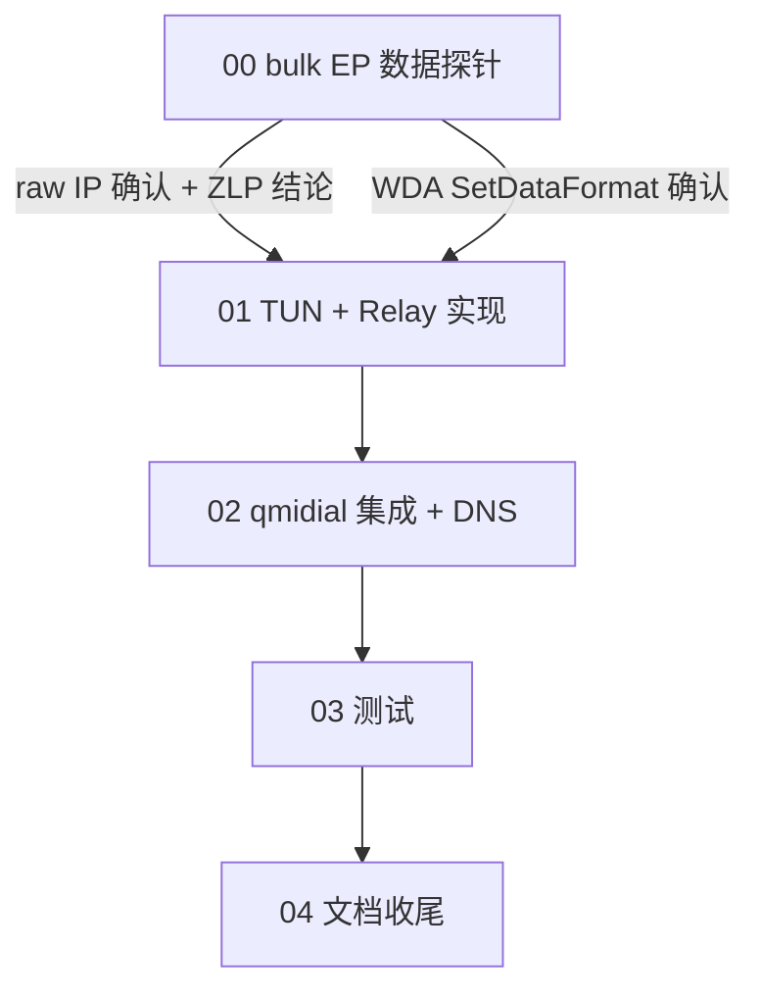

# 阶段 3 实施计划:TUN 虚拟网卡 + 实际上网(总览)

> 基于 `docs/01` §六阶段 3 路线图。阶段 2(QMI 拨号)已完成。
> 创建于 2026-07-12。
>
> 目标:把 QMI 数据通道的 raw IP 包中继到 TUN 虚拟网卡,实现真实上网。

## 核心挑战

阶段 2 拿到了运营商 IP(WDS StartNetwork 成功),但这个 IP 只存在于 QMI 控制层——
没有实际的数据通路。阶段 3 要建立 **USB bulk EP ↔ TUN** 的双向 raw IP 中继。

**关键事实(阶段 3 调研结论):**

1. **上游 quectel-qmi-go 是纯控制面**,数据完全依赖内核 `qmi_wwan` 驱动。没有任何
   用户态 bulk EP 数据中继代码。阶段 3 的中继层必须**从零实现**。

2. **MI_04 同时承载控制面和数据面**,在同一 claim 下:
   - 控制面(已实现):EP0 control + interrupt EP 0x89
   - 数据面(待实现):bulk IN EP 0x88 + bulk OUT EP 0x05
   - 两个面使用不同 endpoint,**无竞争**,可并行

3. **WDA SetDataFormat 是关键前置**。当前阶段 2 **未分配 WDA**(因为 `cfg.Device.NetInterface`
   为空 → `shouldAllocateWDA()` 返回 false)。阶段 3 必须设 `NetInterface` 触发 WDA 分配 +
   `enableRawIP`(设 modem 为 raw-IP 模式,LinkProtocol=0x02,关闭 QMAP 聚合)。

4. **raw-IP 模式下,bulk EP 上是裸 IP 包**,无以太网头、无 QMUX 封装、无 QMAP 头。
   TUN 库也是 layer-3(IP only,无以太网头)。两者格式完全一致——直接中继即可。

5. **Linux 驱动确认**(参考 `references/linux-driver/q_drivers/qmi_wwan/qmi_wwan_q.c`):
   - EC25(0x2C7C:0x0125)匹配 `QMI_FIXED_RAWIP_INTF(0x2C7C, 0x0125, 4, mdm9x07)`
   - `driver_info = qmi_wwan_raw_ip_info_mdm9x07`,`.data = (5<<8)|4`(QMAPV1, 4KB)
   - `.flags = FLAG_WWAN | FLAG_RX_ASSEMBLE | FLAG_NOARP | FLAG_SEND_ZLP`
   - **默认 qmap_mode=0**(模块参数,无 QMAP)→ 走 `qmi_wwan_tx_fixup`/`qmi_wwan_rx_fixup`(raw-IP)
   - **`FLAG_SEND_ZLP`**:TX URB 长度是 maxPacketSize(512B)整数倍时,内核自动追加 ZLP
   - RX:`rx_urb_size = 1520`(1500+14+6),非 512 倍数,无 ZLP 问题
   - DTR 在 `bind()` 中设置(`0x22, 0x21, wValue=1, wIndex=ifaceNum`)——印证阶段 2 Phase 0 发现
   - QMAP 头格式(降级参考):`struct qmap_hdr { u8 pad; u8 mux_id; u16 pkt_len; }`(4 字节,大端)

## 头号风险

### R1: bulk EP 是否真的承载 IP 数据(**MEDIUM-HIGH**)

Phase 0 探针(阶段 2)测过 bulk EP 传 QMI 控制消息 → **不通**。但那是用 bulk EP 发 QMI
控制帧(模型 A),跟 IP 数据是两回事。IP 数据走 bulk EP 是 `qmi_wwan` 的标准行为——
但我们从未在 QDC507 上验证过。

**缓解**:阶段 3 子计划 00 做 Phase 0 数据探针——WDA SetDataFormat + WDS StartNetwork 后,
从 bulk IN EP 0x88 读数据,检查是否是 IP 包(IP version nibble = 4 或 6)。

### R2: WDA SetDataFormat 在 QDC507 上是否成功(**LOW-MEDIUM**)

标准 QMI 命令,QC 平台通用。但 QDC507 是 DJI 定制固件,有私有行为可能。
阶段 2 从未分配 WDA。

**缓解**:子计划 00 探针先测 WDA SetDataFormat,失败则降级到 QMAP 模式(需额外适配)。

### R3: Wintun.dll 集成(**LOW**)

标准操作:下载 wintun.dll 放 exe 同目录。WireGuard 项目成熟,文档齐全。
需要管理员权限创建适配器。

### R4: gousb bulk Read 的包边界(**LOW-MEDIUM**)

USB bulk 传输:每个 IP 包是一个 URB(USB Request Block)。libusb 的 `bulk_transfer` 在收到
short packet(末尾 URB < maxPacketSize)时返回。如果 IP 包恰好是 maxPacketSize 的整数倍,
modem 需要发 ZLP(Zero Length Packet)表示结束。多数 modem 正确处理,少数不发 ZLP。

**缓解**:使用足够大的 read buffer(65535),依赖 short packet 检测。如果有包粘连问题,
切到固定 1600B buffer + 短读策略。

### R5: TX 方向 ZLP(Zero Length Packet)(**MEDIUM**)

Linux 驱动设了 `FLAG_SEND_ZLP`:当 TX URB 长度是 bulk OUT EP maxPacketSize(512B,USB 2.0)
的整数倍时,内核自动追加 ZLP 告诉 modem"传输结束"。libusb/gousb **不自动发 ZLP**。
如果 IP 包恰好是 512 或 1024 字节(不太常见但 TCP payload 可能命中),modem 可能
等待更多数据导致包卡在缓冲区。

**缓解**:
1. 初始版本不做 ZLP,测试是否真的卡(多数 modem 有超时重发,不致命)
2. 如果卡:`tunToModem` 在 `bulkOut.Write(pkt)` 后,如果 `len(pkt)%512==0`,再写一个
   0 字节 `bulkOut.Write([]byte{})` 发 ZLP
3. 注意:gousb v1.1.3 对 0 字节 Write 的行为未验证(可能拒绝或可能发 ZLP)。需要实测。
4. WinUSB 的 ZLP 行为与 Linux libusb 可能不同,需跨平台验证。

## 数据通路架构

```
┌──────────────┐   raw IP   ┌──────────────────┐   raw IP   ┌──────────────┐
│ Host network │ ─────────▶ │  TUN Device      │ ─────────▶ │ Modem USB    │
│  stack       │  TUN.Read  │  (wireguard/tun) │  bulk OUT  │ EP 0x05 OUT  │
│              │ ◀───────── │                  │ ◀───────── │ EP 0x88 IN   │
│              │  TUN.Write │                  │  bulk IN   │              │
└──────────────┘            └──────────────────┘            └──────────────┘
```

- **Flow 1 (TUN → modem)**: `tun.Read()` → 裸 IP 包 → `bulkOut.WriteContext()`
- **Flow 2 (modem → TUN)**: `bulkIn.ReadContext()` → 裸 IP 包 → `tun.Write()`
- 两个方向格式完全一致(WDA raw-IP + TUN layer-3 均无额外头部)

## 代码结构(新增)

```
internal/
├── qmitransport/
│   ├── qmitransport.go           # 现有(信令,EP0+intr 0x89)
│   ├── bulkendpoints.go          # 新增:OpenBulkEndpoints() 返回 EP 0x88/0x05
│   └── ...
├── qmidatapath/                  # 新增 package(数据中继)
│   ├── bridge.go                 # Bridge 结构体 + Start/Stop 生命周期
│   ├── relay.go                  # 双向中继(bulk IN→TUN, TUN→bulk OUT)
│   ├── relay_test.go             # mock 单测(注入 fake BulkReader/Writer + fake TUN)
│   └── relay_hardware_test.go    # 硬件集成测试(build tag: hardware)
└── ...
cmd/
├── qmidial/                      # 现有,扩展:加 -tun 标志启动 TUN + relay
└── bulkprobe/                    # 新增:阶段 3 门控探针
```

预计新增代码量:**~300-350 行**(relay ~100 + bulkendpoints ~30 + bridge ~50 + DNS ~40 + 探针 ~50 + 测试)。

## 子计划索引

| # | 子计划 | 依赖 | 状态 | 文件 |
|---|---|---|---|---|
| 00 | Phase 0 — bulk EP 数据探针 | 阶段 2 完成 | 待实现(头号风险门控) | `00-bulk-ep-data-probe.md` |
| 01 | TUN + relay 实现 | 00 通过 | 待实现 | `01-tun-datapath-impl.md` |
| 02 | qmidial 集成 + 网络配置 + DNS | 01 | 待实现 | `02-integration.md` |
| 03 | 测试(mock + 硬件) | 02 | 待实现 | `03-tests.md` |
| 04 | 文档 + 提交(收尾) | 03 | 待实现 | `04-docs-and-commit.md` |

## 依赖关系



**00 是门控**:如果 bulk EP 不承载 IP 数据,整个方案需要调整(QMAP? 802.3? 另一个接口?)。
01-04 等 00 通过后才有意义。

## 关键设计结论

### TUN 库选型

`golang.zx2c4.com/wireguard/tun`:
- WireGuard 官方 TUN 层,三平台(Linux/macOS/Windows)
- Layer-3(裸 IP,无以太网头)——与 modem raw-IP 格式完全匹配
- Windows 用 Wintun.dll(需额外下载放在 exe 旁,~40KB)
- macOS 用 utun(内核内置)
- Linux 用 /dev/net/tun(内核内置)
- API: `CreateTUN(name, mtu)` → `Device{Read, Write, Name, MTU, Close}`
- Read/Write 用 `[][]byte` 批量接口,offset=4(macOS 需要 4 字节 headroom,三平台通用)
- Windows BatchSize()=1(单包处理);Linux/macOS 可批量

### Bridge 依赖注入(可测性)

TUN 设备作为 `tunDevice` 接口注入 Bridge,而非 Bridge 内部创建:
```go
func New(tun tunDevice, bulkIn BulkReader, bulkOut BulkWriter, offset, mtu int, zlp bool) *Bridge
```
- **测试时**:注入 fake TUN(channel-based mock),relay 逻辑完全离线可测,不需要管理员权限/Wintun.dll
- **生产时**:调用方先 `tun.CreateTUN(name, mtu)`,再把 Device 传入 Bridge
- `zlp bool` 从子计划 00 探针 D2 结果取(探针驱动的参数化)

### WDA 分配(阶段 2 遗留修复)

阶段 3 必须设 `cfg.Device.NetInterface = tunName`:
- `shouldAllocateWDA()` → true → 分配 WDA service
- `enableRawIP()` → `wda.SetDataFormat(LinkProtocolIP, agg=disabled)` → modem 切 raw-IP
- `configureNetwork()` → netcfg 在 TUN 接口上设 IP/路由/MTU

### netcfg 逐函数评估(本轮调研)

| netcfg 函数 | Linux | Windows | macOS | 阶段 3 用途 |
|---|---|---|---|---|
| `SetIPAddress` | ✅ netlink | ✅ netsh | ✅ ifconfig | TUN 配 IP |
| `AddDefaultRoute` | ✅ netlink | ✅ netsh(gwmetric=1) | ✅ route | 默认路由 |
| `SetMTU` | ✅ ip link | ✅ netsh | ✅ ifconfig | MTU=1500 |
| `BringUp` | ✅ ip link set up | ✅ netsh admin=enable | ✅ ifconfig up | 启接口 |
| **`UpdateDNS`** | ✅ 直写 resolv.conf | ❌ **`return error` stub** | ❌ **`return nil` no-op** | **DNS 配置** |

**DNS 必须自建**(子计划 02):Windows `netsh interface ip set dns` / macOS `networksetup -setdnsservers` / Linux `resolvectl` 或直写 resolv.conf。

### QMAP vs raw-IP

首选用 **raw-IP**(无聚合),因为:
- 格式最简单:bulk EP 上的数据 = 裸 IP,直接中继到 TUN
- `enableRawIP` 已实现(LinkProtocolIP + agg disabled)
- 不需要 QMAP 的多路复用(单 PDN 足够)
- Linux 驱动确认 EC25 默认 `qmap_mode=0`(raw-IP)

如果探针发现非 raw-IP(首字节 0x00-0x7f = mux_id),降级方案(relay 加 4 字节头处理):
- RX(modem→TUN):剥 `[mux_id(1)][flags(1)][pkt_len_be16(2)]` 头,取 IP payload
- TX(TUN→modem):加 4 字节头,mux_id=0x81(单 PDN),pkt_len = IP 包长度(大端)
- 子计划 01 §六有完整 strip/add 代码

### 并发安全

bulk EP 的 Read/Write 与 QMI 控制面(EP0+interrupt)**使用不同 endpoint,无竞争**。
relay goroutine 只操作 bulk EP,QMITransport 的 ioMu 只保护 EP0 control transfer。

**Close 时序(严格,防 segfault)**:
1. `Bridge.Stop()` → cancel relay context → 等两个 goroutine 退出(`wg.Wait()`)
2. `QMITransport.Close()` → 释放 USB iface

绝不能反过来——释放 iface 时 relay 还在读写 bulk EP → segfault(issue/001 类)。

### 权限要求

| 平台 | 权限 | 原因 |
|---|---|---|
| Windows | 管理员 | 创建 Wintun 适配器 + netsh 配 IP/DNS |
| macOS | root(sudo) | 创建 utun + ifconfig + networksetup |
| Linux | root 或 CAP_NET_ADMIN | 创建 TUN + ip addr/route |

## 平台前置

| 平台 | 前置操作 |
|---|---|
| Windows | 下载 `wintun.dll`(amd64)放 exe 旁;以管理员运行 |
| macOS | 以 root 运行(sudo) |
| Linux | 以 root 或 CAP_NET_ADMIN 运行 |
