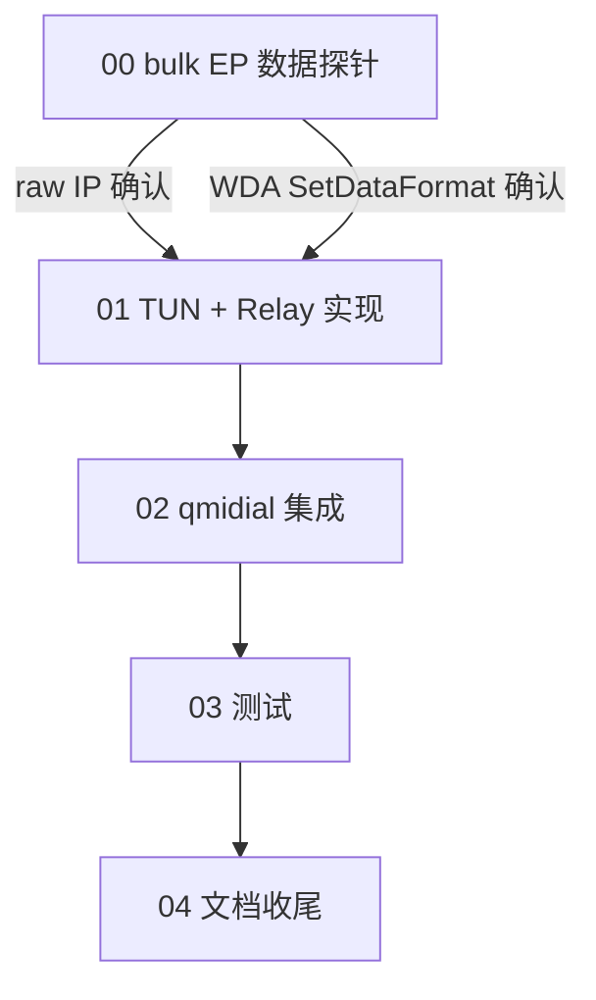

# 阶段 3 实施计划:TUN 虚拟网卡 + 实际上网(总览)

> 基于 `docs/01` §六阶段 3 路线图。阶段 2(QMI 拨号)已完成。
> 创建于 2026-07-12。
>
> 目标:把 QMI 数据通道的 raw IP 包中继到 TUN 虚拟网卡,实现真实上网。

## 核心挑战

阶段 2 拿到了运营商 IP(WDS StartNetwork 成功),但这个 IP 只存在于 QMI 控制层——
没有实际的数据通路。阶段 3 要建立 **USB bulk EP ↔ TUN** 的双向 raw IP 中继。

**关键事实(阶段 3 调研结论):**

1. **上游 quectel-qmi-go 是纯控制面**,数据完全依赖内核 `qmi_wwan` 驱动。没有任何
   用户态 bulk EP 数据中继代码。阶段 3 的中继层必须**从零实现**。

2. **MI_04 同时承载控制面和数据面**,在同一 claim 下:
   - 控制面(已实现):EP0 control + interrupt EP 0x89
   - 数据面(待实现):bulk IN EP 0x88 + bulk OUT EP 0x05
   - 两个面使用不同 endpoint,**无竞争**,可并行

3. **WDA SetDataFormat 是关键前置**。当前阶段 2 **未分配 WDA**(因为 `cfg.Device.NetInterface`
   为空 → `shouldAllocateWDA()` 返回 false)。阶段 3 必须设 `NetInterface` 触发 WDA 分配 +
   `enableRawIP`(设 modem 为 raw-IP 模式,LinkProtocol=0x02,关闭 QMAP 聚合)。

4. **raw-IP 模式下,bulk EP 上是裸 IP 包**,无以太网头、无 QMUX 封装、无 QMAP 头。
   TUN 库也是 layer-3(IP only,无以太网头)。两者格式完全一致——直接中继即可。

## 头号风险

### R1: bulk EP 是否真的承载 IP 数据(**MEDIUM-HIGH**)

Phase 0 探针(阶段 2)测过 bulk EP 传 QMI 控制消息 → **不通**。但那是用 bulk EP 发 QMI
控制帧(模型 A),跟 IP 数据是两回事。IP 数据走 bulk EP 是 `qmi_wwan` 的标准行为——
但我们从未在 QDC507 上验证过。

**缓解**:阶段 3 子计划 00 做 Phase 0 数据探针——WDA SetDataFormat + WDS StartNetwork 后,
从 bulk IN EP 0x88 读数据,检查是否是 IP 包(IP version nibble = 4 或 6)。

### R2: WDA SetDataFormat 在 QDC507 上是否成功(**LOW-MEDIUM**)

标准 QMI 命令,QC 平台通用。但 QDC507 是 DJI 定制固件,有私有行为可能。
阶段 2 从未分配 WDA。

**缓解**:子计划 00 探针先测 WDA SetDataFormat,失败则降级到 QMAP 模式(需额外适配)。

### R3: Wintun.dll 集成(**LOW**)

标准操作:下载 wintun.dll 放 exe 同目录。WireGuard 项目成熟,文档齐全。
需要管理员权限创建适配器。

### R4: gousb bulk Read 的包边界(**LOW-MEDIUM**)

USB bulk 传输:每个 IP 包是一个 URB(USB Request Block)。libusb 的 `bulk_transfer` 在收到
short packet(末尾 URB < maxPacketSize)时返回。如果 IP 包恰好是 maxPacketSize 的整数倍,
modem 需要发 ZLP(Zero Length Packet)表示结束。多数 modem 正确处理,少数不发 ZLP。

**缓解**:使用足够大的 read buffer(65535),依赖 short packet 检测。如果有包粘连问题,
切到固定 1600B buffer + 短读策略。

## 数据通路架构

```
┌──────────────┐   raw IP   ┌──────────────────┐   raw IP   ┌──────────────┐
│ Host network │ ─────────▶ │  TUN Device      │ ─────────▶ │ Modem USB    │
│  stack       │  TUN.Read  │  (wireguard/tun) │  bulk OUT  │ EP 0x05 OUT  │
│              │ ◀───────── │                  │ ◀───────── │ EP 0x88 IN   │
│              │  TUN.Write │                  │  bulk IN   │              │
└──────────────┘            └──────────────────┘            └──────────────┘
```

- **Flow 1 (TUN → modem)**: `tun.Read()` → 裸 IP 包 → `bulkOut.WriteContext()`
- **Flow 2 (modem → TUN)**: `bulkIn.ReadContext()` → 裸 IP 包 → `tun.Write()`
- 两个方向格式完全一致(WDA raw-IP + TUN layer-3 均无额外头部)

## 代码结构(新增)

```
internal/
├── qmitransport/
│   ├── qmitransport.go           # 现有
│   ├── bulkendpoints.go          # 新增:OpenBulkEndpoints() 返回 EP 0x88/0x05
│   └── ...
├── tunbridge/                    # 新增 package
│   ├── tunbridge.go              # Bridge 结构体 + Start/Stop 生命周期
│   ├── relay.go                  # 双向中继(bulk IN→TUN, TUN→bulk OUT)
│   ├── relay_test.go             # mock 单测(注入 mock BulkReader/Writer + fake TUN)
│   └── relay_hardware_test.go    # 硬件集成测试(build tag: hardware)
└── ...
cmd/
├── qmidial/                      # 现有,扩展:加 -tun 标志启动 TUN + relay
└── bulkprobe/                    # 新增:阶段 3 Phase 0 数据探针
```

预计新增代码量:**~250-300 行**(relay ~100 + bulkendpoints ~30 + tunbridge ~50 + 探针 ~50 + 测试)。

## 子计划索引

| # | 子计划 | 依赖 | 状态 | 文件 |
|---|---|---|---|---|
| 00 | Phase 0 — bulk EP 数据探针 | 阶段 2 完成 | 待实现(头号风险门控) | `00-bulk-ep-data-probe.md` |
| 01 | TUN + DataTransport + Relay 实现 | 00 通过 | 待实现 | `01-tun-datapath-impl.md` |
| 02 | qmidial 集成 + 网络配置 | 01 | 待实现 | `02-integration.md` |
| 03 | 测试(mock + 硬件) | 02 | 待实现 | `03-tests.md` |
| 04 | 文档 + 提交(收尾) | 03 | 待实现 | `04-docs-and-commit.md` |

## 依赖关系



**00 是门控**:如果 bulk EP 不承载 IP 数据,整个方案需要调整(QMAP? 802.3? 另一个接口?)。
01-04 等 00 通过后才有意义。

## 关键设计结论

### TUN 库选型

`golang.zx2c4.com/wireguard/tun`:
- WireGuard 官方 TUN 层,三平台(Linux/macOS/Windows)
- Layer-3(裸 IP,无以太网头)——与 modem raw-IP 格式完全匹配
- Windows 用 Wintun.dll(需额外下载放在 exe 旁,~60KB)
- macOS 用 utun(内核内置)
- Linux 用 /dev/net/tun(内核内置)
- API: `CreateTUN(name, mtu)` → `Device{Read, Write, Name, MTU, Close}`
- Read/Write 用 `[][]byte` 批量接口,offset=4(macOS 需要 4 字节 headroom)

### WDA 分配(阶段 2 遗留修复)

阶段 3 必须设 `cfg.Device.NetInterface = tunName`:
- `shouldAllocateWDA()` → true → 分配 WDA service
- `enableRawIP()` → `wda.SetDataFormat(LinkProtocolIP, agg=disabled)` → modem 切 raw-IP
- `configureNetwork()` → netcfg 在 TUN 接口上设 IP/路由/MTU/DNS

### QMAP vs raw-IP

首选用 **raw-IP**(无聚合),因为:
- 格式最简单:bulk EP 上的数据 = 裸 IP,直接中继到 TUN
- `enableRawIP` 已实现(LinkProtocolIP + agg disabled)
- 不需要 QMAP 的多路复用(单 PDN 足够)

如果 modem 不支持 raw-IP(需要 QMAP),降级方案:
- bulk EP 数据带 QMAP 头(1-4 字节):需要 strip/add 头部
- 或用 WDA SetQMAPSettings + WDS BindMuxDataPort 配置 QMAP mode

### 网络配置

利用现有 `netcfg` 包:
- Windows: `netsh interface ip set address name="<tun>" static <ip> <mask>`
- Linux: `ip addr add <ip>/<prefix> dev <tun>`
- macOS: `ifconfig <tun> <ip> <peer> up`

netcfg 已有 SetIPAddress/AddDefaultRoute/SetMTU/UpdateDNS,manager.configureNetwork() 自动调用。

### 并发安全

bulk EP 的 Read/Write 与 QMI 控制面(EP0+interrupt)**使用不同 endpoint,无竞争**。
relay goroutine 只操作 bulk EP,QMITransport 的 ioMu 只保护 EP0 control transfer。
不需要额外同步。

Close 时:先 cancel relay context(stop relay goroutines),再走 QMITransport.Close()。

### 权限要求

- **Windows**:管理员权限(创建 Wintun 适配器需要)
- **macOS**:root(创建 utun + ifconfig 需要)
- **Linux**:CAP_NET_ADMIN(创建 TUN + 配置 IP 需要)

## 平台前置

| 平台 | 前置操作 |
|---|---|
| Windows | 下载 `wintun.dll`(amd64)放 exe 旁;以管理员运行 |
| macOS | 以 root 运行(sudo) |
| Linux | 以 root 或 CAP_NET_ADMIN 运行 |
